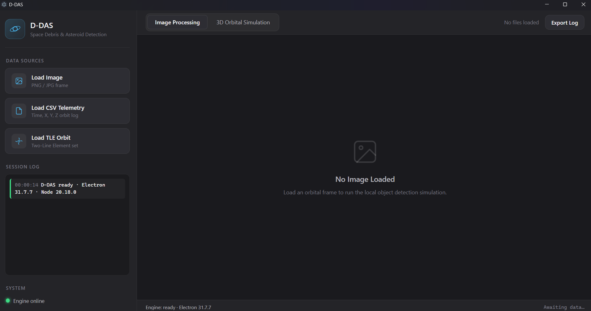
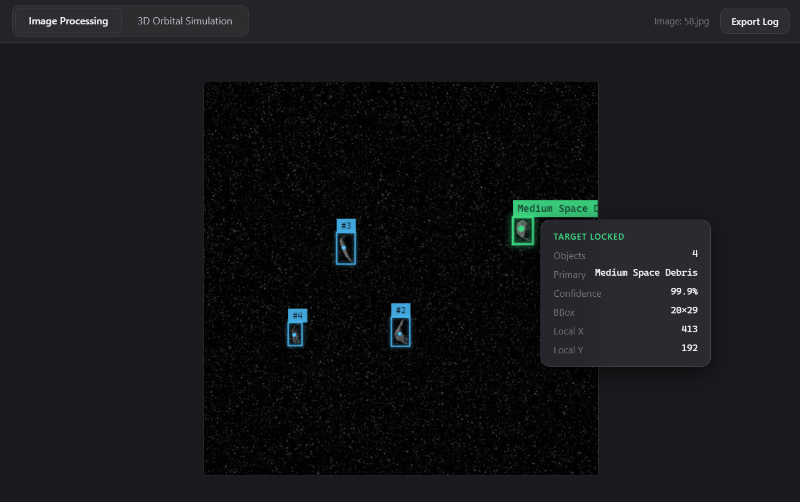
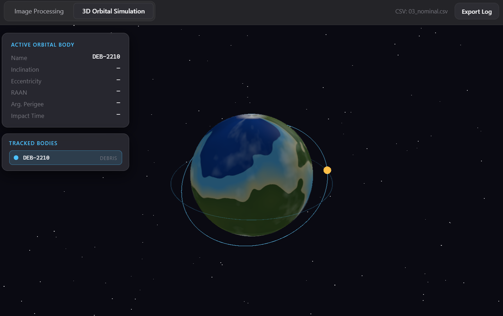

# D-DAS: Debris Detection & Asteroid Simulation

[](https://opensource.org/licenses/MIT)
[](https://www.electronjs.org/)
[](https://threejs.org/)
[](https://github.com/shashwatak/satellite-js)

**D-DAS** is a professional desktop application for space debris detection and asteroid tracking with real-time 3D orbital simulation. Built with Electron, Three.js, and satellite.js (SGP4 propagator), it provides both image-based object detection and orbital trajectory analysis in a single unified interface.

---

## 🎯 Features

### 🖼️ Image Processing & Object Detection
- **Load orbital frames** (PNG/JPG) for local debris detection simulation
- **Real-time detection overlay** with bounding boxes and confidence scores
- **Target classification**: Space Debris vs Asteroid with confidence metrics
- **Coordinate mapping**: Local X/Y position tracking for detected objects
- **Export analysis logs** for documentation and reporting

### 🌍 3D Orbital Simulation
- **SGP4-accurate orbit propagation** using satellite.js
- **Real-time 3D visualization** with Three.js (Earth, clouds, orbits, bodies)
- **Multi-body tracking**: Satellites, debris, and asteroids simultaneously
- **Collision risk assessment**: CRITICAL / WARNING / NOMINAL classification
- **Closest approach computation** with distance, time, and relative velocity
- **Interactive camera controls** (orbit, zoom, pan) with auto-follow mode

### 📊 Data Source Support
| Format | Description | Use Case |
|--------|-------------|----------|
| **Images** | PNG, JPG | Optical frame analysis |
| **CSV Telemetry** | Time, X, Y, Z (+ VX, VY, VZ, Mass) | Custom trajectory logs |
| **TLE Files** | Two-Line Element sets | NORAD/SPACE-TRACK catalog data |

### 🎨 Professional UI/UX
- **Fluent Design System** inspired interface
- **Dark theme** optimized for mission-control environments
- **Responsive layout** with collapsible sidebar
- **Real-time status bar** with engine/load indicators
- **Toast notifications** for async operations
- **Keyboard accessible** with full ARIA support

---

## 📸 Screenshots

### Main UI — Dual-Pane Dashboard


*Clean, professional interface with sidebar for data sources, session log, and system status. Tab strip switches between Image Processing and 3D Orbital Simulation.*

---

### Image Processing — Debris Detection


*Loaded orbital frame with simulated detection overlay. Detection card shows target classification (Space Debris), confidence score (96.4%), bounding box coordinates, and local position.*

---

### 3D Orbital Simulation — Impact Risk Assessment


*Three-body scenario (satellite + debris) with real-time SGP4 propagation. Active body panel shows orbital elements (inclination, eccentricity, RAAN, arg. perigee). Body list tracks all objects with color-coded risk badges. Closest approach computed at 12.3 km — classified as **CRITICAL**.*

---

## 🏗️ Architecture

```
d-das/
├── main.js                 # Electron main process
├── preload.js              # Secure IPC bridge (contextBridge)
├── index.html              # Main window HTML (Fluent Design)
├── styles.css              # Complete styling system
├── renderer.js             # Renderer process (UI logic + Three.js)
├── renderer/lib.js         # Core algorithms (parsing, SGP4, collision)
├── package.json            # Dependencies & scripts
└── test/                   # Validation suite
    ├── scenarios/          # CSV + TLE test fixtures
    ├── run-scenarios.js    # Automated scenario validator
    └── generate-scenarios.js  # Fixture generator
```

### Core Technologies
| Layer | Technology | Purpose |
|-------|------------|---------|
| **Runtime** | Electron 31 | Cross-platform desktop shell |
| **3D Engine** | Three.js r166 | WebGL scene, Earth, orbits, bodies |
| **Orbital Math** | satellite.js 7.x | SGP4 propagator, TLE parsing |
| **Image Gen** | pngjs | Procedural Earth/cloud texture baking |
| **Data Parsing** | Custom (lib.js) | CSV/TLE parsing, coordinate transforms |

### Data Flow
```
User Input (File Dialog)
        │
        ▼
┌───────────────────┐     ┌────────────────────┐
│   IPC (preload)   │────▶│  main.js Handlers  │
└───────────────────┘     └────────────────────┘
        │                         │
        ▼                         ▼
┌───────────────────┐     ┌────────────────────┐
│  renderer.js UI   │     │  File I/O (fs)     │
│  + lib.js Core    │     │  Texture Baking    │
└───────────────────┘     └────────────────────┘
        │
        ▼
┌───────────────────┐
│  Three.js Scene   │
│  + SGP4 Prop      │
└───────────────────┘
```

---

## 🚀 Quick Start

### Prerequisites
- **Node.js** 18+ (LTS recommended)
- **npm** 9+ (bundled with Node)

### Installation
```bash
# Clone the repository
git clone https://github.com/Snehishere/D-DAS.git
cd D-DAS

# Install dependencies
npm install

# Start the application
npm start
```

### Development Mode
```bash
# Launch with DevTools open
npm run dev
```

### Build for Distribution
```bash
# Requires electron-builder config (not yet configured)
npm run build
```

---

## 📖 Usage Guide

### Loading an Image for Detection
1. Click **Load Image** in the sidebar
2. Select a PNG/JPG orbital frame
3. View detection results in the **Image Processing** tab
4. Detection card shows: count, classification, confidence, bbox, local coords

### Loading CSV Telemetry
1. Click **Load CSV Telemetry**
2. Select a CSV file with columns: `time, x, y, z` (optional: `vx, vy, vz, mass`)
3. Auto-switches to **3D Orbital Simulation** tab
4. Trajectory rendered as orbital path with velocity vectors

### Loading TLE Orbit Data
1. Click **Load TLE Orbit** (supports multi-select)
2. Select `.tle` or `.txt` files from SPACE-TRACK / CelesTrak
3. SGP4 propagation runs automatically (2 orbital periods, 360 points)
4. Orbital elements displayed: inclination, eccentricity, RAAN, arg. perigee

### Collision Risk Assessment
- **CRITICAL** (🔴) — Closest approach < 25 km
- **WARNING** (🟠) — Closest approach 25–100 km
- **NOMINAL** (🟢) — Closest approach > 100 km

### Exporting Session Log
Click **Export Log** in the header to save a timestamped analysis report (`.txt`).

---

## 🧪 Testing & Validation

The project includes an automated test suite validating the collision detection pipeline against known scenarios:

```bash
# Run scenario validator (uses lib.js + satellite.js directly)
node test/run-scenarios.js
```

### Test Scenarios
| Scenario | Description | Expected Risk |
|----------|-------------|---------------|
| `01_critical` | Head-on collision course | **CRITICAL** |
| `02_warning` | Close pass ~50 km | **WARNING** |
| `03_nominal` | Safe separation > 500 km | **NOMINAL** |
| `04_geo_vs_leo` | GEO vs LEO crossing | **WARNING** |
| `05_headon` | Direct opposition | **CRITICAL** |

Fixtures are in `test/scenarios/csv/` and `test/scenarios/tle/`. Regenerate with:
```bash
node test/generate-scenarios.js
```

---

## ⚙️ Configuration

### Texture Caching
Earth/cloud textures are procedurally generated on first run and cached to:
- **Windows**: `%APPDATA%/d-das/textures/`
- **Linux**: `~/.config/d-das/textures/`
- **macOS**: `~/Library/Application Support/d-das/textures/`

### Window Settings
Adjust in `main.js`:
```javascript
mainWindow = new BrowserWindow({
  width: 1440,
  height: 900,
  minWidth: 1024,
  minHeight: 700,
  // ...
});
```

---

## 🤝 Contributing

1. Fork the repository
2. Create a feature branch: `git checkout -b feature/amazing-feature`
3. Commit changes: `git commit -m 'Add amazing feature'`
4. Push to branch: `git push origin feature/amazing-feature`
5. Open a Pull Request

### Code Style
- **ES Modules** (`type: "module"` in package.json)
- **ESLint** recommended (add `.eslintrc` if desired)
- **Prettier** for formatting

---

## 📄 License

Distributed under the **MIT License**. See `LICENSE` for more information.

---

## 🙏 Acknowledgments

- **[satellite.js](https://github.com/shashwatak/satellite-js)** — SGP4/SDP4 implementation
- **[Three.js](https://threejs.org/)** — 3D graphics engine
- **[Electron](https://www.electronjs.org/)** — Desktop app framework
- **[pngjs](https://github.com/pngjs/pngjs)** — PNG encoding
- **NASA/SPACE-TRACK** — TLE data standards
- **CelesTrak** — Public TLE catalogs

---

## 📞 Support

- **Issues**: [GitHub Issues](https://github.com/Snehishere/D-DAS/issues)
- **Discussions**: [GitHub Discussions](https://github.com/Snehishere/D-DAS/discussions)
- 

---

**Built with ❤️ for space situational awareness**
